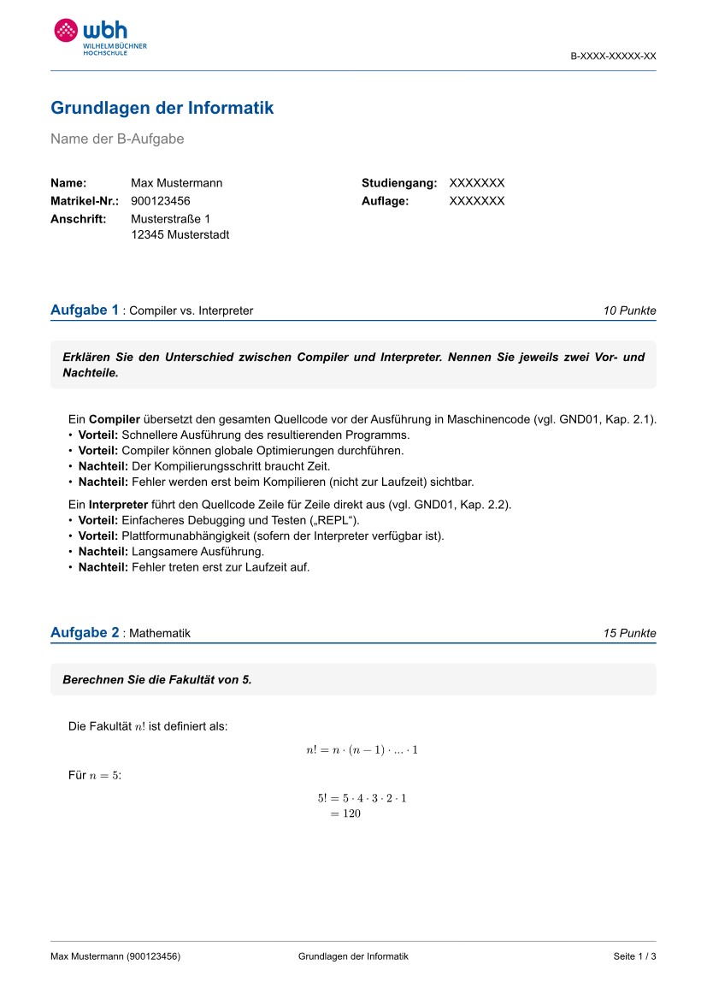

# WBH Exam Template

Unofficial [Typst](https://typst.app) template for B-Aufgaben (written assignments) at the Wilhelm Büchner Hochschule, in WBH colors and layout.

<p align="center">
  
</p>

## Installation

The template is not on Typst Universe yet, so install it as a local package. Requires [Typst](https://github.com/typst/typst#installation) 0.15 and Python 3.11+ (or [uv](https://docs.astral.sh/uv/)).

```bash
git clone https://github.com/YaRissi/wbh-exam-template.git
cd wbh-exam-template
python scripts/install.py   # or: uv run scripts/install.py
```

The script copies the package into Typst's local package directory (`~/.local/share/typst/packages/local` on Linux, `~/Library/Application Support/typst/packages/local` on macOS, `%APPDATA%\typst\packages\local` on Windows). Re-run it after pulling updates.

## Quick start

```bash
typst init @local/wbh-exam-template:0.4.3 my-assignment
cd my-assignment
typst watch main.typ
```

This creates a project with `main.typ`, example tasks in `tasks/`, a `references.bib` and the `wbh-numeric.csl` citation style.

## Usage

### Document setup

```typst
#import "@local/wbh-exam-template:0.4.3": project

#show: project.with(
  last_name: "Mustermann",
  first_name: "Max",
  assignment_code: "B-GND01-XX1-K02",
  street: "Musterstraße 1",
  zip_city: "12345 Musterstadt",
  student_id: "900123456",
  course_id: "123456",
  assignment_title: "Grundlagen der Informatik",
  b_exam_name: "Thema der B-Aufgabe",
  edition: "XXXXXXX",
)

#include "tasks/task1.typ"
```

| Field              | Description                                       |
| :----------------- | :------------------------------------------------ |
| `last_name`        | Surname                                           |
| `first_name`       | Given name                                        |
| `assignment_code`  | Official code, e.g. `B-GND01-XX1-K02`             |
| `street`           | Street and house number                           |
| `zip_city`         | Postal code and city                              |
| `student_id`       | Matrikelnummer                                    |
| `course_id`        | Studiengangsnummer                                |
| `assignment_title` | Module title                                      |
| `b_exam_name`      | Name of the B-Aufgabe                             |
| `edition`          | Edition (Auflage) of the B-Aufgabe                |
| `cite_display`     | Optional citation acronyms, see [Citing](#citing) |

### Tasks

```typst
#import "@local/wbh-exam-template:0.4.3": solution, subtask, task

#task(points: 10, title: "Compiler vs. Interpreter")[
  Task description, rendered on a grey background.
]

#subtask(title: "a)", points: 4)[
  Subtask description.
]

#solution[
  Your answer, indented below the task.
]
```

Tasks are numbered automatically.

### Citing

The scaffold cites study booklets by their code, e.g. `(vgl. GND01, Kap. 2.1)`, and each citation links to a numbered bibliography that uses the bundled `wbh-numeric.csl` style:

```
[1] (GND01) Max Mustermann. Grundlagen der Informatik. 0123K01. Wilhelm Büchner Hochschule.
```

Set the code in the `note` field of each `references.bib` entry; the bibliography shows it in brackets:

```bib
@book{gnd01,
  author    = {Max Mustermann},
  title     = {Grundlagen der Informatik},
  publisher = {Wilhelm Büchner Hochschule},
  edition   = {0123K01},
  note      = {GND01}
}
```

Map each key to the label shown in the text, then pass the same map to `project` and to `bibliography_section`:

```typst
#let cite_display = ("gnd01": "GND01", "claude_ai": "Claude")

#show: project.with(/* ... */, cite_display: cite_display)

#bibliography_section(
  bibliography("references.bib", style: "wbh-numeric.csl", title: "Literaturverzeichnis", full: true),
  cite_display: cite_display,
)
```

Cite in the text with a chapter or page as the supplement:

```typst
Ein Compiler übersetzt den Quellcode vorab (vgl. @gnd01[Kap.~2.1]).
```

`bibliography()` must be called in your own file so that `references.bib` resolves relative to your project. `bibliography_section` adds the page break before the bibliography.

`#source("key", supplement: "S. 12")` is still available for superscript citations, and with `model:` and `prompt:` it adds a footnote documenting an AI prompt.

## Fonts

The template uses Arial and falls back to Calibri. If neither is installed (common on Linux), install them or pass `--font-path`; otherwise Typst warns and uses its default font.

## Development

```
src/lib.typ                  public entry point
src/components/layout.typ    page setup, header/footer, title block
src/components/elements.typ  task, subtask, solution, source, bibliography_section
src/components/utils.typ     colors
template/                    project scaffold used by typst init
scripts/install.py           local installer
```

Build the example in place with `typst compile --root . template/main.typ`. CI checks formatting with `typstyle --check .` and compiles the template.

## License

[MIT](LICENSE)
